# DevPath (FieldProject) 🚀

DevPath is an AI-powered project recommendation engine and career-guidance chatbot designed to help developers identify, build, and bookmark the perfect projects to enhance their resumes, portfolios, or university assignments. It dynamically interacts with users to learn their tech stack, goals, and interests, and generates tailored project roadmaps.

## Architecture Overview

DevPath is built on a modern, highly resilient tech stack utilizing Next.js, Firebase, and a dual-layer AI strategy to guarantee uptime and fast response times.

### Tech Stack
* **Frontend Workflow:** Next.js 15 (App Router, Turbopack), React 19
* **Styling & Components:** Tailwind CSS, shadcn/ui, Radix UI Primitives, Lucide Icons
* **Database & Authentication:** Firebase Firestore (Client-side usage & Non-blocking updates)
* **AI & LLM Services:** 
  * **Primary Model:** Groq API (`llama3-70b-8192`) 
  * **Secondary/Fallback Model:** Google Gemini API (`gemini-2.5-flash`) via the `google-genai` Genkit plugin.

---

## Technical Workflows & Features

### 1. Dual-Layer AI Generation with Resilience Setup
The system employs an extremely robust request-handling mechanism (`ai-retry.ts`) designed to circumvent API limits automatically.
* **Attempt 1:** The application sends prompts to **Groq**. 
* **Attempt 2-4 (Exponential Backoff):** If the Groq API returns a rate limit exception (`429`) or server overload, the system silently retries. It pauses for 2000ms initially, multiplying the delay by 1.5x on subsequent failures.
* **Fallback Trigger:** If Groq continues to fail, or encounters a critical structural error (e.g., Missing `.env` API Key, internal `500 Server Error`, fetch partition), the system breaks the retry loop and immediately hands the request off to **Gemini**.

### 2. Conversational Chat flow
Users navigate to the `/new-chat` route and complete a pre-screening survey (Tech Experience, Goal). The app initializes a new `Conversation` document in Firestore and pre-populates initial system prompts. Inside the chat UI, the AI iteratively asks questions to uncover the user's specific interests.

### 3. Project Roadmap Generation
After sufficient chatting (threshold of 3 messages), the user can generate projects. Under the hood, the backend instructs the AI models to process the entire `ChatHistory` array and export an exact JSON output conforming to a strict schema containing:
* `title`, `description`, `whyItMatchesUser`, `techStack`, `difficulty`, `resumeValue`, and an actionable `roadmap`. 
These results are heavily cached and written locally to Firestore.

### 4. Interactive Dashboard & Benchmark Gallery
The personalized `/dashboard` leverages complex multi-collection Firestore queries (using composite indexes for `ownerId` and `isBookmarked`) to retrieve data asynchronously. 
* **Profile Insights**: Displays the AI-inferred user capabilities (Goals, preferences, raw tech strings).
* **Benchmark Gallery**: An independent, global/community section displaying social-proofed trending project ideas ordered by community `upvotes`.

---

## Detailed Sequence Diagram (AI Chat Flow & Fallback)

```mermaid
sequenceDiagram
    autonumber
    actor User
    participant NextJS as NextJS Frontend
    participant ServerActions as Server Actions (Actions.ts)
    participant RetryEngine as AI Retry Utility
    participant GroqAPI as Groq API (Primary)
    participant GeminiAPI as Gemini API (Fallback)
    participant Firestore as Firebase Firestore

    User->>NextJS: Submits Chat Message / Clicks 'Generate Projects'
    NextJS->>ServerActions: getSimpleChatResponse(chatHistory)
    ServerActions->>RetryEngine: withAiRetryAndFallback(...)
    
    rect rgb(30, 40, 50)
        Note right of RetryEngine: Phase 1: Primary Pipeline Attempt
        RetryEngine->>GroqAPI: Call Llama-3 (GroqChat/GroqRecommendations)
        alt Success
            GroqAPI-->>RetryEngine: Returns JSON/Text
        else Rate Limit / Overload
            GroqAPI-->>RetryEngine: 429 Error
            RetryEngine->>RetryEngine: Exponential Backoff (Wait & Retry x3)
        else Critical Error (Missing Key / Server Down)
            GroqAPI-->>RetryEngine: Structural API Error
            RetryEngine->>RetryEngine: Break loop immediately
        end
    end
    
    alt Groq Succeeded inside retries
        RetryEngine-->>ServerActions: Return Final Groq Content
    else Groq Failed / Loop Exhausted
        rect rgb(50, 40, 30)
            Note right of RetryEngine: Phase 2: Ultimate Fallback Pipeline
            RetryEngine->>GeminiAPI: useFallbackFn (Google GenAI)
            GeminiAPI-->>RetryEngine: Returns Back-up JSON/Text
        end
        RetryEngine-->>ServerActions: Return Gemini Content
    end
    
    ServerActions-->>NextJS: Data Payload
    NextJS->>Firestore: Non-blocking write `addDocumentNonBlocking()`
    NextJS-->>User: Renders UI (Project Cards / Chat Bubbles)
```



## Database Schema (Firestore)

- **`users/{uid}/conversations/{convoId}`**: Tracks individual chat sessions. Contains:
  - **`messages/`**: Standard message logs (`sender`, `content`, `timestamp`)
  - **`profileSummaries/`**: High-level inferences extracted by AI (`inferredInterests`, `goals`, `skillLevel`)
  - **`projectRecommendations/`**: Array of curated projects (`roadmap`, `difficulty`, `isBookmarked`).
- **`benchmarkGallery/`** (Root Level): A community-driven board tracking trending template projects (`upvotes`, `category`, `description`).

## Getting Started Locally

1. **Clone & Install**:
   ```bash
   git clone <repo>
   npm install
   ```
2. **Environment Variables**: Create a `.env` file at the root.
   ```env
   GROQ_API_KEY=your_primary_groq_key
   GEMINI_API_KEY=your_fallback_gemini_key
   # Also add any standard Firebase environment keys if required
   ```
3. **Run the Server**:
   ```bash
   npm run dev
   ```
   *Available on `http://localhost:9002`.*

4. **Seed Database (Optional)**: If you're establishing the project on a blank Firestore instance, utilize the temporary **"Seed Gallery"** button found on the `/dashboard` page to construct initial community mock data for the Benchmark Gallery.
